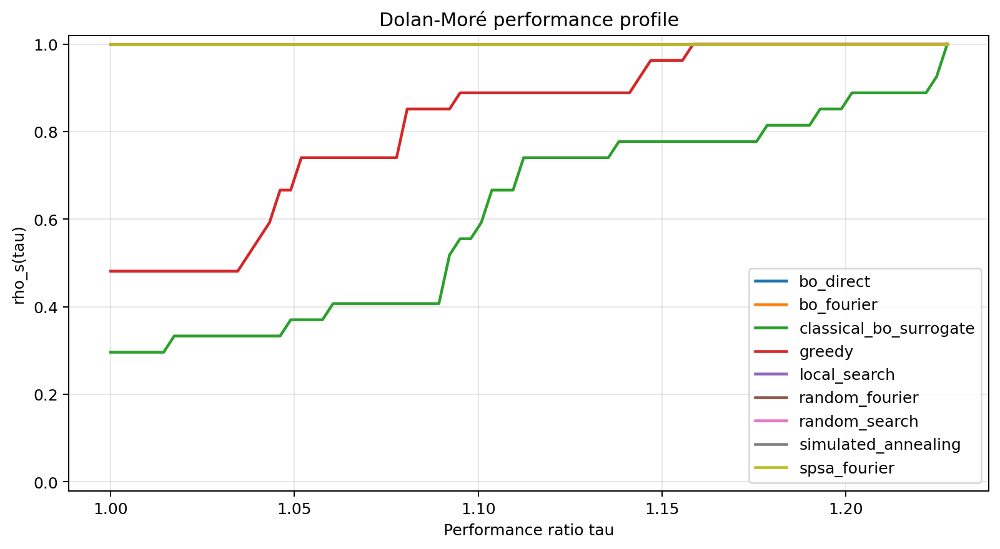

# SpinMesh Runtime: Execution-Body Deformation in QAOA for Frustrated Spin Systems

**Short description:** SpinMesh studies QAOA as a physical instrument running through a real execution body: routing, calibration age, shot budget, backend topology, queue delay, session drift, and mitigation can deform the measured spin-system physics.



**Headline result.** In the `paper_full` benchmark, valid-ratio collapse below `0.5` appears in `100.0%` of aggregated QAOA windows even though `bo_fourier` remains the matched-call sample-efficiency leader and the deployment recommendation still stays classical (`results/paper_full/submission_full_findings.json`, `results/paper_full/submission_full_executive_summary.md`).

**Plain-English takeaway.** Runtime is not only cost. Runtime is a physical deformation channel. The current evidence does not support a practical QAOA win on the studied workloads, and that negative decision is part of the scientific output.

This repository studies **execution-body deformation** in QAOA for constrained random-bond **J1-J2 Ising** systems. Instead of treating runtime as bookkeeping, SpinMesh asks whether the physical conclusion remains stable after a fixed source-level circuit passes through routing, calibration drift, finite shots, backend topology, session policy, and measurement correction.

`spinmesh_runtime` is the supported public package surface; `ionmesh_runtime` remains only for internal compatibility and backward support.

## What this repo proves

- QAOA can be evaluated as an executed physical experiment, not only as an abstract ansatz.
- The current evidence is still classical-first: the saved `paper_full` decision layer recommends `exact_feasible`, not QAOA deployment.
- The repo's value is decision-quality, not advantage-claiming: it tells you when runtime conditions make a quantum result less trustworthy than classical baselines.

For one concrete negative-result memo, see [docs/why_classical_still_wins.md](docs/why_classical_still_wins.md).

## What this project is

- a study of whether execution conditions change physical conclusions in QAOA experiments
- a provenance layer for routing, calibration, shot, session, mitigation, and backend effects
- a trust-gated decision framework that can reject quantum results when the execution body has deformed the physics too much

## What this project is not

- not a quantum advantage claim
- not only an optimizer benchmark
- not only runtime accounting
- not a finance or portfolio optimizer

See [docs/execution_body_deformation.md](docs/execution_body_deformation.md) for the full framing and experiment roadmap.

## One-command reproducibility

Run these from an activated virtual environment:

```bash
python -m pip install -e ".[dev,quantum,runtime]"
python -m spinmesh_runtime.cli --mode single --runtime-mode local_proxy --n-spins 6 --magnetization-m 0 --lattice-type j1j2_frustrated --j1-coupling 1.0 --j2-coupling 0.5 --depth 2 --fourier-modes 2
PYTHONPATH=src python tools/run_execution_body_experiments.py --output-dir results/execution_body
pytest
```

## Budget frontier snapshot

Best observed QAOA windows from `results/paper_full/submission_full_aggregates.csv`, compared against the repo-wide execution recommendation in `results/paper_full/submission_full_executive_summary.md`:

| Workload size | Best observed QAOA valid ratio | Runtime burden in that window | Recommended method |
| --- | --- | --- | --- |
| `n_spins = 4` | `0.5625` via `bo_direct` | `5152` shots, `8` objective calls, `0.127 s` mean runtime | `exact_feasible` |
| `n_spins = 6` | `0.4583` via `bo_direct` | `2592` shots, `8` objective calls, `0.166 s` mean runtime | `exact_feasible` |
| `n_spins = 8` | `0.3935` via `bo_fourier` | `3104` shots, `4` objective calls, `0.023 s` mean runtime | `exact_feasible` |

The practical message is simple: pilot-scale QAOA can still be explored, but the current benchmark evidence stays classical-first once valid-sector reliability and runtime burden are accounted for together.

## Frustration-axis valid-ratio sweep

The fine `J2/J1` sweep in `results/frustration_axis/` fixes `n_spins = 8`, `p = 2`, and `256` shots while sweeping `J2/J1 = 0.0, 0.1, ..., 1.0`. Under the clean local-proxy Dicke/XY path, valid-sector ratio declines as frustration is increased but does **not** collapse below `0.5`; at `J2/J1 = 0.5`, the all-method mean is `0.8783`.

The routed Aer control in `results/frustration_axis_aer/` fixes a six-spin routed execution body and does reproduce collapse, but it is broad rather than sharply localized: the mean valid-sector ratio at `J2/J1 = 0.5` is `0.3166`, while the endpoint mean is `0.3154`.

This refines the headline: valid-ratio collapse is currently better explained as an execution-body deformation effect than as a sharp intrinsic dip exactly at the `J2/J1 = 0.5` point.

## Research question

> For a fixed frustrated-spin QAOA problem, when do runtime conditions change the physical conclusion of the experiment: energy ranking, magnetization, correlations, phase identification, or quantum-vs-classical decision, even if the source-level circuit and optimizer are unchanged?

## Main contribution

The main contribution of this repo is not a claim of quantum advantage. It is a **reproducible execution-body framework** that combines:

- a problem layer for constrained frustrated-spin instances
- a runtime-aware execution contract across `local_proxy`, `aer`, and IBM Runtime paths
- an `ExecutionDeformationVector` record for routing, calibration, shot, session, mitigation, and observable deformation
- a `RuntimeTrustGate` that accepts, warns, or rejects quantum results using canonical physical trust reasons
- a decision / utility-frontier layer that converts benchmark outputs into an execution recommendation
- a study pipeline that compares classical baselines, QAOA variants, mitigation bundles, and backend choices under matched operational constraints

On small systems, the framework is honest about negative or flat results. Classical baselines are not only faster here; they are often more physically stable under the measured execution conditions.

## Physics model

We study Ising spins `sigma_i in {-1, +1}` with fixed magnetization:

```text
E(sigma) = -sum_{i<j} J_ij sigma_i sigma_j - sum_i h_i sigma_i
subject to sum_i sigma_i = M
```

Using `sigma_i = 2 x_i - 1`, the problem maps onto the existing constrained binary QUBO stack with:

- binary variables `x_i in {0,1}`
- cardinality constraint `sum_i x_i = k = (M + N) / 2`
- quadratic objective `x^T Q x + constant`

That lets the repo reuse the optimizer, runtime, tracking, checkpoint, and decision infrastructure with minimal structural change.

## Supported lattice families

- `random_bond`
- `afm_uniform`
- `j1j2_frustrated`
- `diluted`
- `random_ferrimagnet`

The main study axis is the **frustration ratio** `J2 / J1`, with `J2 / J1 ~= 0.5` treated as the maximally frustrated point.

## Benchmark questions

The study pipeline is organized around three explicit questions:

1. Does BO-tuned Fourier QAOA beat SPSA-tuned QAOA in sample efficiency for frustrated ground-state search?
2. Does readout mitigation plus ZNE materially improve ground-state quality near the frustrated point?
3. How does valid-ratio collapse scale with system size, depth, and frustration ratio?

## Architecture

- **Problem layer**: lattice generation, QUBO conversion, exact feasible optimum, frustration metrics, remap vs penalty handling
- **Baselines**: exact search, greedy, local search, simulated annealing, random feasible search, classical BO surrogate
- **Quantum layer**: proxy, Aer, and Runtime V2 runners with Dicke-state initialization for the constrained sector
- **Optimization layer**: Fourier/direct parameterizations, BO/SPSA/random tuning, penalty epochs, checkpoint/resume
- **Tracking and reporting**: JSON/CSV/SQLite, findings reports, performance profiles, utility frontiers, executive summaries
- **Decision layer**: cost-aware execution recommendation under matched runtime budgets
- **Validation layer**: live certification, calibration snapshotting, live-vs-Aer validation helpers

## Key instance metadata

Each benchmark instance records:

- `lattice_type`
- `n_spins`
- `magnetization_m`
- `j1_coupling`
- `j2_coupling`
- `j2_ratio`
- `disorder_strength`
- `frustration_index`
- `energy_gap_to_second_lowest` when available

## Output artifacts

A study sweep writes:

- `*_results.json`
- `*_summary.csv`
- `*.sqlite`
- `*_aggregates.csv`
- `*_performance_profile.csv`
- `*_findings.json`
- `*_findings.md`
- `*_findings.tex`
- plots:
  - `*_approx_gap.png`
  - `*_sample_efficiency.png`
  - `*_success_vs_noise.png`
  - `*_valid_ratio_vs_depth.png`
  - `*_valid_sector_ratio_vs_spins.png`
  - `*_energy_gap_vs_j2_ratio.png`
  - `*_mitigation_vs_shots.png`
  - `*_performance_profile.png`

Execution-body studies write records, trust reports, and plots under `results/execution_body/`; see [results/execution_body/README.md](results/execution_body/README.md). The current compact execution-body sweep contains `90` records and shows that the same fixed source circuit changes observable error as transpiled depth and two-qubit count inflate.

## Detailed install options

Base install:

```bash
python -m venv .venv
source .venv/bin/activate
pip install -r requirements.txt
pip install -e .
```

With Aer:

```bash
pip install -e ".[quantum]"
```

With IBM Runtime support:

```bash
pip install -e ".[quantum,runtime]"
```

With developer extras:

```bash
pip install -e ".[dev,quantum,runtime]"
```

## More CLI examples

Smoke test:

```bash
python -m spinmesh_runtime.cli --mode smoke --runtime-mode local_proxy
```

Single benchmark on a frustrated six-spin instance:

```bash
python -m spinmesh_runtime.cli \
  --mode single \
  --runtime-mode aer \
  --n-spins 6 \
  --magnetization-m 0 \
  --lattice-type j1j2_frustrated \
  --j1-coupling 1.0 \
  --j2-coupling 0.5 \
  --depth 2 \
  --fourier-modes 2
```

Study sweep over size, frustration ratio, and disorder:

```bash
python -m spinmesh_runtime.cli \
  --mode study \
  --runtime-mode local_proxy \
  --study-num-seeds 4 \
  --study-n-spins 4,6,8 \
  --study-j2-ratios 0.0,0.25,0.5,0.75,1.0 \
  --study-disorder-levels 0.0,0.1,0.3 \
  --study-depths 1,2,3 \
  --study-shot-budgets 64,128,256 \
  --output-prefix results/ising_study/ising_runtime_qaoa
```

Pilot study:

```bash
python tools/run_pilot_study.py
```

Paper-style local study:

```bash
python tools/run_paper_study.py --profile full --label submission_full --output-dir results/paper_full
```

Live validation harness:

```bash
python tools/run_live_validation.py --runtime-backend ibm_fez --live-repeats 2 --aer-repeats 2
```

Runtime trust report from execution-deformation records:

```bash
python -m spinmesh_runtime.cli \
  --mode runtime_trust_report \
  --execution-body-input results/execution_body/execution_deformation_records.csv \
  --trust-policy configs/runtime_trust_gate.yaml \
  --runtime-trust-output results/execution_body/runtime_decision_boundary.md
```

## Project structure

```text
src/spinmesh_runtime/        active public package path
tests/                       regression and benchmark tests
tools/                       study, validation, and release helpers
docs/                        architecture and reporting notes
configs/                     trust-gate and run-policy examples
```

## Notes

- Historical compatibility shims exist for older scripts, but the active user-facing semantics are Ising-native: `n_spins`, `magnetization_m`, `lattice_type`, and `J2/J1`.
- The exact-state bookkeeping remains exponential in `n_spins`, so large-scale claims should be interpreted carefully.
