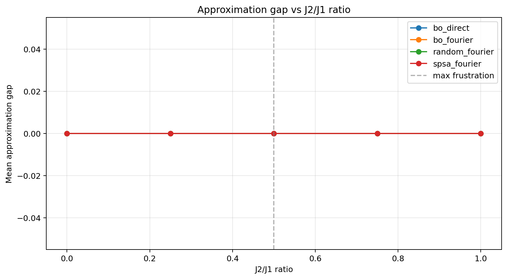
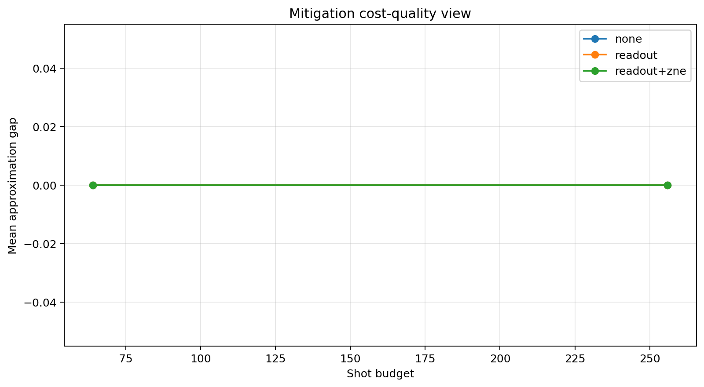
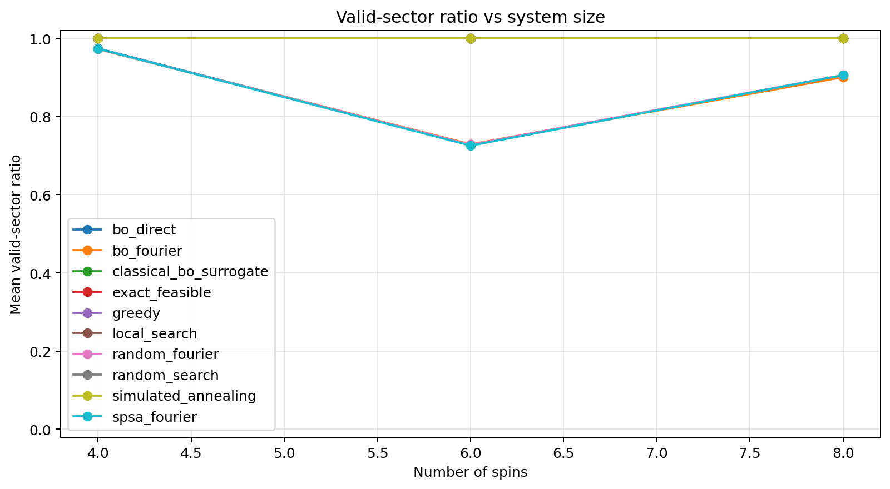
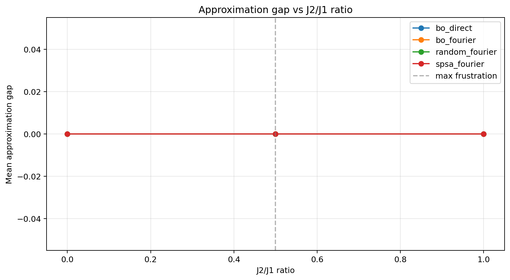
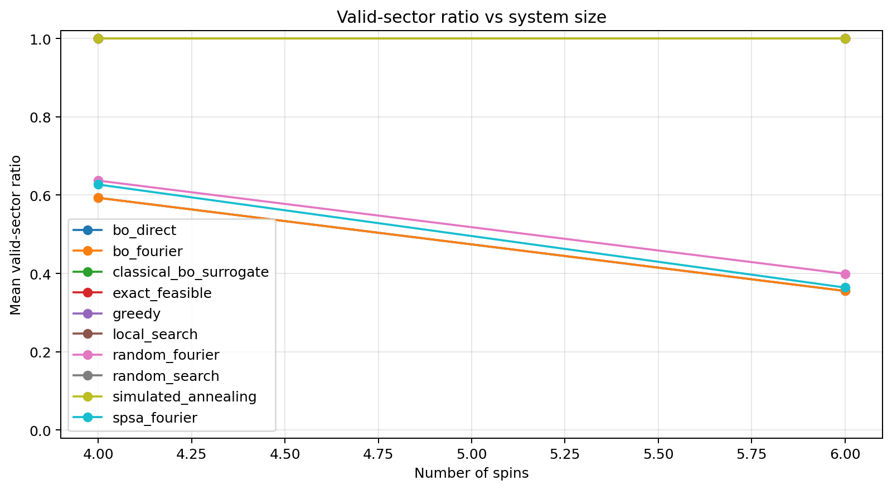

# Runtime-Aware QAOA-Style Ground-State Search in the Fixed-Magnetization J1-J2 Ising Model

## Abstract

We report a reproducible benchmark study of a runtime-aware quantum optimization stack after repurposing an earlier quadratic-binary optimization codebase into a physics-native workflow for constrained ground-state search in the random-bond J1-J2 Ising model on small open-boundary square-lattice patches. The target problem minimizes a classical Ising Hamiltonian in a fixed-magnetization sector, which the implementation maps exactly into a cardinality-constrained quadratic unconstrained binary optimization (QUBO) instance. The repository couples that mapping to a Dicke-initialized, symmetry-preserving alternating-operator ansatz; Fourier and direct parameterizations; Bayesian optimization (BO), simultaneous perturbation stochastic approximation (SPSA), and random-search tuning; readout mitigation and zero-noise extrapolation (ZNE); and a runtime-tracking layer that records JSON, CSV, and SQLite artifacts together with shot usage and wall-clock cost. We evaluate the pivoted system on two backends: a stochastic `local_proxy` execution path and `qiskit-aer` with an explicit relaxation, depolarization, and readout noise model. The main compact physics study contains 720 local-proxy trial cells and 12,960 recorded outcomes, while the Aer companion study contains 48 trial cells and 864 recorded outcomes.

The main empirical result is negative but informative. Across the pivot validation bundles, BO-tuned and SPSA-tuned QAOA-style runs are statistically indistinguishable in approximation quality, with `delta_auc = 0` and Mann-Whitney `p = 1.0` on both backends [Table 3]. Readout mitigation plus ZNE does not improve mean approximation gap and slightly decreases mean success probability in the present study grid [Table 3]. The dominant observable is instead valid-sector preservation: on `local_proxy`, the mean valid-sector ratio degrades monotonically from 0.9818 at `J2/J1 = 0.0` to 0.6646 at `J2/J1 = 1.0`, whereas the nominally maximally frustrated point `J2/J1 = 0.5` is only intermediate at 0.9451 [Table 4]; on Aer, mean valid-sector ratio collapses to approximately 0.49 across the tested ratios [Table 3]. Approximation ratios saturate at 1.0 for all compact-study QAOA rows, so the repository's present scientific signal is backend-sensitive sector preservation rather than energy improvement. This is an honest systems-and-benchmarking result: the pivot produces a mathematically correct constrained Ising benchmarking framework, but not evidence that the implemented QAOA-style ansatz outperforms classical baselines on the tested instances.

## I. Introduction

The question of whether near-term quantum optimization algorithms can provide useful performance on frustrated many-body systems remains unresolved. In condensed-matter language, the challenge is not merely to approximate a low energy, but to do so in a physically meaningful symmetry sector, under realistic shot budgets, hardware noise, compilation constraints, and classical control latency [1]-[4]. In quantum-software language, the challenge is subtler still: many repositories present elegant abstractions yet leave unanswered whether the generated artifacts support falsifiable scientific conclusions. This work addresses that gap for a concrete software project.

The repository studied here was pivoted from an earlier application-specific binary optimization stack to a physics-first workflow for constrained ground-state search in the J1-J2 Ising model. The target problem is a random-bond, open-boundary nearest-neighbor and next-nearest-neighbor Ising model with a fixed magnetization constraint. The central research question is:

> Under realistic shot, noise, mitigation, and backend-management constraints, when does a runtime-aware QAOA-style workflow improve constrained ground-state search in the J1-J2 Ising model over classical baselines and lower-cost tuning strategies?

This is scientifically meaningful for three reasons. First, the J1-J2 family is a canonical model of frustration on square-lattice geometries and remains a standard stress test for competing interactions, degeneracy, and phase ambiguity [23]-[26]. Second, fixed magnetization is not an artificial software-side penalty but a symmetry-sector restriction with a direct physical interpretation. Third, practical NISQ evaluation depends as much on execution contract and measurement accounting as on formal ansatz design [2], [12]-[20].

The present manuscript is deliberately written around the repository's actual evidence rather than its aspirational roadmap. The pivot is mathematically sound and extensively tested, but the empirical findings are more modest than a typical promotional QAOA narrative. In the compact pivot-validation bundles, all QAOA methods reach approximation ratio 1.0 on the recorded best feasible energies, classical exact solvers dominate at zero shot cost, mitigation does not help on average, and the strongest backend-dependent signal is valid-sector collapse rather than energy separation [Table 3]. That is not a failure of scientific reporting; it is precisely the sort of null result that a reproducible benchmark should surface.

This paper makes four concrete contributions:

- It formalizes and validates the exact spin-to-QUBO and fixed-magnetization-to-cardinality mapping used by the repository, with direct unit tests against brute-force small-system enumeration [Listing 1], [Table A2].
- It documents the actual implemented ansatz, namely a Dicke-initialized alternating-operator circuit with global `RZ` layers and nearest-neighbor `RXX`/`RYY` mixers, and distinguishes it from a full instance-encoded cost-Hamiltonian QAOA [Listing 2].
- It reports the pivoted benchmark results from the repository's generated artifacts, including 12,960 `local_proxy` outcomes and 864 Aer outcomes, with explicit cost, shot, and backend statistics [Tables 1, 3-6].
- It explains why the current data do not support a strong `J2/J1 = 0.5` hardness-cliff claim, identifying finite-size geometry, frustration-metric saturation, and ansatz-model mismatch as the main culprits [Section VIII].

The remainder of the paper is organized as follows. Section II reviews the relevant quantum-algorithm, mitigation, and frustrated-magnetism literature. Section III develops the exact theoretical mapping from the constrained Ising model to the repository's QUBO representation. Section IV describes the system design, ansatz, objectives, and accounting policy. Section V details the implementation with code citations. Section VI describes the experimental setup. Section VII reports the empirical findings. Section VIII interprets the negative results and remaining limitations. Sections IX and X provide future work and conclusion, and the appendices contain notation, reproducibility commands, extended tables, and code listings.

## II. Background and Related Work

### II.A. Variational quantum optimization and constrained mixers

QAOA was introduced as an alternating application of a cost Hamiltonian and a mixer Hamiltonian parameterized by angle vectors `\boldsymbol{\gamma}` and `\boldsymbol{\beta}` [3]. The algorithm rapidly became a focal point of NISQ optimization because it combines shallow circuits with a classical outer loop, and because discrete optimization objectives admit direct Hamiltonian encodings [3], [22], [35], [37]. However, constrained optimization immediately raises a design problem: a standard transverse-field mixer does not preserve hard constraints. Hadfield et al. generalized QAOA into the alternating-operator ansatz (AOA), emphasizing mixers that preserve feasible subspaces and initial states chosen from those subspaces [4]. That perspective is especially relevant here because the repository's present ansatz is better described as a Dicke-initialized, symmetry-preserving AOA circuit than as strict canonical QAOA.

Variational quantum algorithms more generally sit in the NISQ design space described by Preskill [2] and later surveys [10], [11], [30]-[34]. Their practical limitations are now well established. Random or weakly structured ansatze can suffer from barren plateaus [8], while even shallow circuits can exhibit cost-function-dependent trainability failures [9]. Resource scaling can be unfavorable when measurement cost and optimizer budget are counted honestly [29], [31], [32]. These concerns motivate input-state engineering, symmetry adaptation, and budget-aware optimizer choice. Recent work on input-state design for VQAs confirms that carefully chosen initial states can improve reachability at fixed circuit budget [28], which is directly relevant to the Dicke-state initialization used in this repository.

### II.B. Bayesian optimization, SPSA, and budget-aware tuning

Classical optimization of variational parameters remains a dominant cost center. SPSA is a standard shot-frugal stochastic optimizer for noisy objectives [16], whereas Bayesian optimization leverages surrogate modeling and acquisition functions to reduce the number of expensive objective evaluations [15]. In the VQA context, recent work has advocated quantum-aware or physics-informed Bayesian surrogates [17], [18]. At the same time, benchmark studies increasingly emphasize that optimizer comparisons must be made under explicit resource accounting, not only final objective value [20], [29]. This repository follows that direction partially but not completely: it records objective calls, primitive calls, shots, and wall-clock time for every trial [Listing 3], yet the compact pivot sweep does not enforce identical call counts across optimizers [Table 5].

### II.C. Error mitigation and runtime-aware NISQ execution

Zero-noise extrapolation and readout mitigation are among the best-studied near-term error-mitigation techniques [12]-[14]. Temme et al. introduced extrapolation and quasiprobability approaches for short-depth circuits [12], while Endo et al. gave a practical treatment oriented toward near-term workloads [13]. Cai et al. later synthesized the field in a broad review [14]. These methods are relevant because NISQ optimization is frequently bottlenecked not by one-shot fidelity but by repeated noisy objective estimation.

Runtime awareness adds a second layer of realism. QAOA is not merely a circuit family; it is a program consisting of many circuit evaluations embedded in a classical optimization loop. Wack et al. argued that speed, quality, and scale must all be included in realistic performance evaluation, especially for hybrid quantum-classical programs [20]. The present repository operationalizes that insight by recording primitive-call budgets, shot counts, and wall-clock time, and by providing execution paths for a proxy backend, Aer, and IBM Runtime.

### II.D. Frustrated J1-J2 physics

The square-lattice J1-J2 family has long served as a canonical setting for frustration. Chandra and Doucot showed that sufficiently frustrated square-lattice Heisenberg interactions can destabilize classical order [23]. Dagotto and Moreo reported evidence for a disordered regime via exact diagonalization [24]. Jiang, Yao, and Balents later found strong evidence for a spin-liquid region in the square-lattice `J1-J2` Heisenberg model [25], while Melzi et al. connected the physics to real materials such as `Li2VOSiO4` [26]. More recent quantum-simulation work has also targeted square-lattice J1-J2 spin models in near-term settings [27].

The present repository studies an Ising rather than Heisenberg Hamiltonian, and it restricts itself to small open-boundary patches, not the thermodynamic square-lattice limit. This distinction matters. The code's frustration metric is plaquette based, and for the tested antiferromagnetic patches it saturates to 1.0 for any positive `J2/J1`, so it cannot by itself identify a special point near `J2/J1 = 0.5` [Table 4]. That mismatch between canonical infinite-lattice narrative and finite-patch observable is a central finding of this paper.

## III. Theoretical Framework

### III.A. Hamiltonian and constrained Hilbert space

Let `N` denote the number of spins and let `\sigma_i \in \{-1,+1\}`. The repository studies the classical Ising Hamiltonian

\[
H(\boldsymbol{\sigma}) = - \sum_{(i,j) \in E_{\mathrm{NN}}} J^{(1)}_{ij}\sigma_i \sigma_j
                         - \sum_{(i,j) \in E_{\mathrm{NNN}}} J^{(2)}_{ij}\sigma_i \sigma_j
                         - \sum_{i=1}^{N} h_i \sigma_i,
\tag{1}
\]

where `E_{\mathrm{NN}}` and `E_{\mathrm{NNN}}` are the nearest-neighbor and next-nearest-neighbor edge sets on an open-boundary lattice patch. In the compact pivot study the active lattice type is `j1j2_frustrated`, with antiferromagnetic nearest- and next-nearest-neighbor couplings perturbed multiplicatively by a disorder factor [Listing 1].

The Hilbert space in the computational basis is `\mathcal{H} = (\mathbb{C}^2)^{\otimes N}`, but the physical search space is the fixed-magnetization sector

\[
\mathcal{H}_{M} = \mathrm{span}\left\{ |\boldsymbol{\sigma}\rangle :
\sum_{i=1}^{N} \sigma_i = M \right\}.
\tag{2}
\]

Introducing binary variables `x_i = (\sigma_i + 1)/2 \in \{0,1\}`, the magnetization constraint becomes

\[
\sum_{i=1}^{N} x_i = k = \frac{M + N}{2}.
\tag{3}
\]

Equation (3) is the cardinality constraint enforced throughout the codebase. The repository stores this quantity as `budget`, inherited from the earlier generic binary-optimization abstraction.

### III.B. Exact spin-to-QUBO mapping

Substituting `\sigma_i = 2x_i - 1` into Eq. (1) gives a QUBO objective

\[
H(\boldsymbol{\sigma}(\mathbf{x})) = \mathbf{x}^{\mathsf{T}} Q \mathbf{x} + c,
\tag{4}
\]

with off-diagonal and diagonal coefficients

\[
Q_{ij} = -4J_{ij}, \qquad i < j,
\tag{5}
\]

\[
Q_{ii} = 2 \sum_{j=1}^{N} J_{ij} - 2 h_i,
\tag{6}
\]

and additive constant

\[
c = - \sum_{i<j} J_{ij} + \sum_{i=1}^{N} h_i.
\tag{7}
\]

Here `J_{ij}` denotes the symmetric combined coupling matrix over both NN and NNN edges. Equations (5)-(7) match the implemented code exactly [Listing 1]. Note that these coefficients differ from alternative conventions that sum pair terms over all ordered pairs; the present repository uses an upper-triangular pair accumulation, so the diagonal and constant terms take the form in Eqs. (6) and (7).

### III.C. Lemma and proof of ordering preservation

**Lemma 1.** Let `H(\boldsymbol{\sigma})` be the constrained Ising objective in Eq. (1), let `\mathbf{x}` be related to `\boldsymbol{\sigma}` by Eq. (3), and let `Q` and `c` be defined by Eqs. (5)-(7). Then for every bitstring `\mathbf{x} \in \{0,1\}^N`,

\[
H(\boldsymbol{\sigma}(\mathbf{x})) = \mathbf{x}^{\mathsf{T}} Q \mathbf{x} + c,
\tag{8}
\]

and therefore the ordering of feasible configurations in the fixed-magnetization sector is preserved exactly.

**Proof.** For any pair `i<j`,

\[
-J_{ij}(2x_i-1)(2x_j-1)
= -4J_{ij}x_ix_j + 2J_{ij}x_i + 2J_{ij}x_j - J_{ij}.
\tag{9}
\]

Summing Eq. (9) over `i<j` yields the quadratic terms in Eq. (5), a linear contribution `2\sum_j J_{ij}` to each variable `x_i`, and the constant `-\sum_{i<j}J_{ij}`. Likewise,

\[
-h_i(2x_i-1) = -2h_i x_i + h_i,
\tag{10}
\]

which contributes the `-2h_i` part of Eq. (6) and the `+\sum_i h_i` part of Eq. (7). Collecting quadratic, linear, and constant terms gives Eq. (8). Since `c` is configuration independent, minimizing the Ising energy and minimizing the QUBO energy are equivalent on the feasible set. `\square`

The repository validates Lemma 1 directly for two-spin and four-spin systems by brute-force comparison of Ising and QUBO energies [Table A2].

### III.D. Complexity model

The exact feasible optimum is computed by enumerating all Hamming-weight-`k` bitstrings. The number of candidates is

\[
\left| \mathcal{F}_{N,k} \right| = \binom{N}{k},
\tag{11}
\]

so exact feasible search scales as `\Theta(\binom{N}{k})` objective evaluations. In the pivot validation studies this is tractable for all tested sizes, including the scaling audit up to `N=14`, because the largest sector is `\binom{14}{7}=3432`. Consequently, the benchmark should be read as a software-and-methodology comparison in a regime where exact classical reference energies are available, not as a demonstration of large-`N` intractability.

### III.E. Ansatz state and measurement metrics

The implemented variational state is not an instance-encoded `e^{-i\gamma H_C}` QAOA circuit. Instead, it is a symmetry-preserving alternating-operator ansatz of the form

\[
|\psi(\boldsymbol{\gamma},\boldsymbol{\beta})\rangle
= \prod_{\ell=1}^{p}
\left[
\prod_{i=1}^{N-1} e^{-i\beta_{\ell} X_i X_{i+1} / 2}
                     e^{-i\beta_{\ell} Y_i Y_{i+1} / 2}
\right]
\left[
\prod_{i=1}^{N} e^{-i\gamma_{\ell} Z_i / 2}
\right]
|D_k^N\rangle,
\tag{12}
\]

where `|D_k^N\rangle` is the Dicke state with Hamming weight `k` [6], [7], [Listing 2]. This choice preserves the target sector at the logical-ansatz level and operationalizes the AOA viewpoint of constrained mixing [4].

Measured bitstring counts `{c_b}` define the valid-sector ratio

\[
r_{\mathrm{valid}} = \frac{1}{S} \sum_b c_b \, \mathbf{1}[|b|_1 = k],
\tag{13}
\]

where `S=\sum_b c_b` is the shot count. The repository also records a success probability

\[
P_{\mathrm{succ}} = \frac{1}{S} \sum_b c_b \, \mathbf{1}[|b|_1 = k]
\, \mathbf{1}[E(b)-E^\star \le \epsilon_{\mathrm{succ}}],
\tag{14}
\]

with `E^\star` the exact feasible optimum and `\epsilon_{\mathrm{succ}}` the repository success tolerance [Listing 3]. Finally, it reports

\[
\rho = 1 + \frac{\max(0, E_{\mathrm{best}}-E^\star)}{\max(|E^\star|,10^{-9})},
\tag{15}
\]

where `\rho=1` is optimal. Equation (15) is the exact implementation of the repository's approximation-ratio metric.

## IV. Methodology and System Design

### IV.A. Lattice generation and instance families

The core problem class is implemented in `IsingSpinProblem` [Listing 1]. The code supports five lattice types: `random_bond`, `afm_uniform`, `j1j2_frustrated`, `diluted`, and `random_ferrimagnet`. The pivot validation bundles use `j1j2_frustrated` exclusively. The lattice geometry is generated by factoring `N` into `(rows, cols)` with `rows` chosen as the largest divisor not exceeding `\lfloor \sqrt{N} \rfloor`. Consequently, the tested instances are not all square: `N=4` gives a `2 \times 2` plaquette, `N=6` a `2 \times 3` patch, and `N=8` a `2 \times 4` patch. This implementation detail matters because it changes the number of plaquettes, boundary-to-bulk ratio, and the qualitative frustration landscape relative to a true `L \times L` square.

For the `j1j2_frustrated` family, nearest-neighbor and next-nearest-neighbor bonds are both antiferromagnetic in sign, with magnitudes perturbed multiplicatively by a uniform disorder factor in `[1-\delta, 1+\delta]`, where `\delta` is the disorder strength [Listing 1]. The main benchmark axis is the ratio `J2/J1`.

### IV.B. Classical baselines

The repository compares four QAOA-style variants against classical baselines:

- exact feasible enumeration,
- local-field greedy,
- local search,
- simulated annealing,
- random search, and
- classical Bayesian optimization on bitstrings.

The exact solver is the scientifically decisive baseline in the present regime because all compact-study sizes remain exactly enumerable. The greedy baseline was rewritten for the pivot and now assigns spins by a local-field heuristic rather than a legacy domain-specific ranking rule.

### IV.C. Quantum objective and optimizer loop

Measured counts are reduced to a CVaR objective [5]. BO is performed with a Gaussian-process surrogate; SPSA uses noisy finite-difference-like perturbations; and a random-search baseline is included for optimizer-cost context. The repository records `objective_calls`, `primitive_calls`, `total_shots`, and `runtime_seconds` for every record [Listing 3]. This accounting enables cost-aware interpretation, although it does not force identical objective-call budgets across methods.

### IV.D. Runtime-aware control logic

The system includes a penalty controller for invalid-sector suppression and a shot-budget governor that can escalate shot counts under stagnation. The governor metadata are stored in the output records, and the tracker serializes results to JSON, CSV, and SQLite. This is important because variational quantum programs should be evaluated as programs with stateful execution and measurement-management overhead, not merely as isolated circuits [20].

### IV.E. Algorithmic summary

**Algorithm 1. Runtime-aware constrained J1-J2 benchmark workflow**

```text
Input: RunDeck cfg with (N, M, J1, J2, disorder, depth, shots, backend, optimizer)
Output: Recorded benchmark artifact with energies, sector metrics, and cost accounting

1. Construct lattice patch and coupling matrix J,h from cfg.
2. Map fixed magnetization M to Hamming-weight sector k = (M + N)/2.
3. Convert Ising objective to QUBO coefficients Q and constant c.
4. Enumerate feasible bitstrings and compute exact feasible optimum E*.
5. Build a Dicke-initialized alternating-operator circuit with depth p.
6. For each optimizer step t:
7.     choose requested shot count via the shot governor;
8.     choose penalty state via the penalty controller;
9.     evaluate the CVaR objective from measured counts;
10.    update optimizer state;
11.    log objective value, best feasible energy, valid-sector ratio, and shots used.
12. Sample a final readout using the incumbent parameter vector.
13. Compute approximation gap, approximation ratio, success probability, and runtime metadata.
14. Serialize JSON, CSV, and SQLite artifacts.
```

## V. Implementation

### V.A. Software stack and package surface

The public package surface is `spinmesh_runtime`, but the current implementation lives in `src/ionmesh_runtime/_internal/`. The compact pivot artifacts record Python `3.13.9`, NumPy `2.3.5`, SciPy `1.16.3`, pandas `2.3.3`, matplotlib `3.10.6`, Qiskit `2.3.0`, Qiskit Aer `0.17.2`, and Qiskit IBM Runtime `0.46.1` (unpublished, this work). The project metadata in `pyproject.toml` identify the package as `spinmesh-runtime`, version `0.8.0`, with author `Hirrresh Sundrq`.

### V.B. Listing 1: Ising-to-QUBO conversion

Listing 1 reproduces the core mapping in `src/ionmesh_runtime/_internal/problem.py`, lines 153-165.

**Listing 1. Python implementation of the exact Ising-to-QUBO map.**

```python
def _to_qubo(self, J: np.ndarray, h: np.ndarray) -> np.ndarray:
    Q = np.zeros((self.n, self.n), dtype=float)
    for i in range(self.n):
        # Linear coefficient induced by sigma_i = 2 x_i - 1
        # after summing all pairwise contributions touching site i.
        Q[i, i] = float(2.0 * np.sum(J[i]) - 2.0 * h[i])
    for i in range(self.n):
        for j in range(i + 1, self.n):
            if abs(J[i, j]) <= 1e-12:
                continue
            # Off-diagonal QUBO term for x_i x_j.
            Q[i, j] = float(-4.0 * J[i, j])
    return Q

def _qubo_constant(self, J: np.ndarray, h: np.ndarray) -> float:
    # Configuration-independent offset added back during evaluation.
    return float(-np.sum(np.triu(J, 1)) + np.sum(h))
```

The associated test suite compares direct Ising energies and QUBO energies for two-spin and four-spin toy systems and confirms exact ordering preservation in the feasible sector [Table A2].

### V.C. Listing 2: Dicke preparation and circuit construction

Listing 2 reproduces the main circuit path in `src/ionmesh_runtime/_internal/quantum.py`, lines 223-256.

**Listing 2. Dicke-initialized alternating-operator circuit used by the repository.**

```python
def _prepare_dicke_state(n: int, k: int, circuit: Any) -> None:
    if k <= 0:
        return
    if k >= n:
        for qubit in range(n):
            circuit.x(qubit)
        return
    amplitudes = np.zeros(2**n, dtype=complex)
    target_prob = 1.0 / comb(n, k)
    for basis_index in range(2**n):
        if basis_index.bit_count() == k:
            # Populate the equal-amplitude k-sector vector exactly.
            amplitudes[basis_index] = np.sqrt(target_prob)
    state_preparation = StatePreparation(amplitudes)
    circuit.append(state_preparation, list(range(n)))

def _build_parametric_qaoa_circuit(cfg: RunDeck, gamma: Any, beta: Any, *, measure: bool) -> Any:
    circuit = QuantumCircuit(cfg.n_assets)
    _prepare_dicke_state(cfg.n_assets, cfg.budget, circuit)
    for layer in range(cfg.depth):
        for qubit in range(cfg.n_assets):
            # Instance-independent single-qubit phase layer.
            circuit.rz(gamma[layer], qubit)
        for qubit in range(cfg.n_assets - 1):
            # Nearest-neighbor XY-like constrained mixer.
            circuit.rxx(beta[layer], qubit, qubit + 1)
            circuit.ryy(beta[layer], qubit, qubit + 1)
    if measure:
        circuit.measure_all()
    return circuit
```

Two facts are crucial. First, the Dicke state is genuinely wired into the production path and verified by dedicated tests [Table A2]. Second, the current implementation uses Qiskit's generic `StatePreparation`, not the lower-depth split-and-cycle construction of Ref. [6]. The hardware cost of Dicke preparation is therefore backend- and transpilation-dependent.

### V.D. Listing 3: Shot-accounted objective evaluation

Listing 3 reproduces the objective-accounting closure in `src/ionmesh_runtime/_internal/pipeline.py`, lines 360-365 and the measurement evaluator in `src/ionmesh_runtime/_internal/quantum.py`, lines 119-157.

**Listing 3. Objective accounting and sector-success evaluation.**

```python
def _evaluate_objective_accounted(params: np.ndarray,
                                  penalty_state: ConstraintPenaltyState,
                                  requested_shots: int) -> TailBatch:
    nonlocal objective_calls_used, objective_shots_used
    batch = runner.evaluate_objective(params, penalty_state, shots=requested_shots)
    # Explicit resource accounting for every optimizer query.
    objective_calls_used += 1
    objective_shots_used += int(batch.total_shots)
    return batch

def measurement_from_counts(self, counts: dict[str, float],
                            penalty_state: ConstraintPenaltyState | None,
                            shots_used: int,
                            backend: str) -> MeasurementOutcome:
    batch = self.evaluate_counts(counts, penalty_state, shots_used, backend)
    vector = self.counts_to_vector(counts)
    _, _, _, success_weight, total_weight = _native_distribution_stats(
        self.base_energies, vector, self.valid_mask, self.success_mask
    )
    success_probability = 0.0 if total_weight <= 0.0 else float(success_weight / total_weight)
    return MeasurementOutcome(
        counts=counts,
        best_bitstring=max(counts.items(), key=lambda item: item[1])[0],
        valid_ratio=batch.valid_ratio,
        feasible_best=batch.feasible_best,
        raw_best=batch.raw_best,
        total_shots=int(shots_used),
        backend=backend,
        success_probability=success_probability,
    )
```

This design is a strength of the repository. Even where the scientific result is negative, the code makes it possible to diagnose whether null findings arise at constant energy but changing shot burden, or at constant shot burden but changing sector stability.

## VI. Experimental Setup

### VI.A. Command surface and reproducibility

The command-line interface is physics-native and explicitly advertises constrained `J1-J2` Ising ground-state benchmarking:

```text
python -m spinmesh_runtime.cli --mode smoke --runtime-mode local_proxy
```

for a smoke test, and

```text
python -m spinmesh_runtime.cli \
  --mode study \
  --runtime-mode local_proxy \
  --study-num-seeds 4 \
  --study-n-spins 4,6,8 \
  --study-j2-ratios 0.0,0.25,0.5,0.75,1.0 \
  --study-disorder-levels 0.0,0.1,0.3 \
  --study-depths 1,2,3 \
  --study-shot-budgets 64,128,256 \
  --output-prefix results/ising_study/ising_runtime_qaoa
```

for a larger study [Appendix B]. In the current tree, `PYTHONPATH=src pytest -q` completes with `46 passed` in 63.75 s on 21 April 2026, with only non-failing Qiskit deprecation warnings (unpublished, this work).

### VI.B. Backends

The benchmark uses three backend paths in principle, but only two are used as clean spin-native evidence in the pivot study:

- `local_proxy`: a stochastic proxy runner whose logits combine energy, local field, nearest-neighbor mixer profiles, leakage, and optional mitigation [Listing 2].
- `aer`: a Qiskit Aer path with thermal relaxation, depolarizing, and readout noise configured from `t1_time`, `t2_time`, `gate_time`, `depol_error`, and readout asymmetry [13], [19].
- `runtime`: IBM Runtime support exists, but the currently committed `ibm_fez` artifacts remain partially legacy and are treated only as runtime-path validation in Appendix D.

One implementation caveat must be stated explicitly. The compact Aer study stores a `noise_level` sweep axis in its output schema, but the active `NoiseModelFactory.build()` method does not consume `cfg.noise_level`; it consumes the physical fields `t1_time`, `t2_time`, `depol_error`, and readout parameters. Accordingly, backend-to-backend comparisons remain meaningful, but claims about an Aer `noise_level` sweep must be interpreted conservatively.

### VI.C. Study grids

**Table 1. Compact pivot-validation study grids.**

| Backend | `N` values | Depths `p` | `J2/J1` ratios | Disorder levels | Shot budgets | Noise labels | Seeds | Trial cells | Recorded outcomes |
| --- | --- | --- | --- | --- | --- | --- | --- | ---: | ---: |
| `local_proxy` | 4, 6, 8 | 1, 2 | 0.0, 0.25, 0.5, 0.75, 1.0 | 0.0, 0.3 | 64, 256 | 0.0, 0.04 | 3 | 720 | 12,960 |
| `aer` | 4, 6 | 1 | 0.0, 0.5, 1.0 | 0.0 | 64, 256 | 0.0, 0.04 | 2 | 48 | 864 |

The main study target is half filling, i.e. `M=0`. Exact feasible energies are available for all compact-study instances. The tracker recommendation produced by both compact bundles is `run_classical`.

### VI.D. Circuit depth and logical gate counts

Because the circuit body is explicit in code, logical gate counts can be derived directly. Excluding transpiler decomposition of `StatePreparation`, each depth layer adds `N` `RZ` gates and `2(N-1)` entangling gates. Representative pre-transpilation counts are shown in Table 2.

**Table 2. Logical circuit size of the implemented ansatz before backend-specific decomposition.**

| `N` | `p` | Circuit depth | Circuit size | Non-measurement ops |
| ---: | ---: | ---: | ---: | --- |
| 4 | 1 | 9 | 15 | `state_preparation:1`, `rz:4`, `rxx:3`, `ryy:3` |
| 4 | 2 | 14 | 25 | `state_preparation:1`, `rz:8`, `rxx:6`, `ryy:6` |
| 6 | 1 | 13 | 23 | `state_preparation:1`, `rz:6`, `rxx:5`, `ryy:5` |
| 6 | 2 | 18 | 39 | `state_preparation:1`, `rz:12`, `rxx:10`, `ryy:10` |
| 8 | 1 | 17 | 31 | `state_preparation:1`, `rz:8`, `rxx:7`, `ryy:7` |
| 8 | 2 | 22 | 53 | `state_preparation:1`, `rz:16`, `rxx:14`, `ryy:14` |

These counts should be read as logical ansatz costs. The compiled gate count of the Dicke preparation itself is backend dependent because it is synthesized by Qiskit from an amplitude vector.

The current repository does **not** archive state fidelity to the exact ground-state wavefunction. All reported quality metrics are therefore energy based or sample-distribution based (`r_{\mathrm{valid}}`, `P_{\mathrm{succ}}`, and `\rho`), not overlap-fidelity measurements. This is a limitation of the present artifact design and should be repaired in future physics-native runs.

## VII. Results and Analysis

### VII.A. Correctness and regression validation

Before interpreting benchmark outcomes, we note that the pivot passes a meaningful unit-test ladder. The current tree passes 46 tests [Table A2]. These include:

- exact agreement between direct Ising energies and QUBO energies for toy systems,
- correctness of the `k=(M+N)/2` mapping,
- feasible-sector enumeration and repair behavior,
- nontrivial frustration-index tests,
- Dicke-state support tests, including edge cases `k=0`, `k=N`, `k=1`, and `k=N-1`,
- confirmation that the production QAOA path uses Dicke initialization, and
- shot-accounting assertions for the pipeline.

This matters because the main empirical findings are negative. When a study reports no advantage, the first question is whether the implementation is broken. Here, the mapping and sector logic are directly validated, so the null results are informative rather than obviously pathological.

### VII.B. Global study outcome

The backend-level summary is given in Table 3.

**Table 3. Core compact-study outcomes.**

| Metric | `local_proxy` | `aer` |
| --- | ---: | ---: |
| Trial cells | 720 | 48 |
| Recorded outcomes | 12,960 | 864 |
| Recommendation | `run_classical` | `run_classical` |
| Mean QAOA valid-sector ratio | 0.8685 | 0.4905 |
| Mean QAOA success probability `P_succ` | 0.7673 | 0.2166 |
| Mean QAOA runtime per record (s) | 0.0558 | 0.4011 |
| Mean QAOA total shots per record | 4917.3 | 3930.7 |
| BO vs SPSA `delta_auc` | 0.0 | 0.0 |
| BO vs SPSA `p` for approximation gap | 1.0 | 1.0 |
| Mean mitigation gain in approximation gap | 0.0 | 0.0 |
| Mean mitigation change in `P_succ` | -0.00424 | -0.00977 |
| Valid-ratio collapse share (`r_valid < 0.5`) | 7.08% | 50.0% |
| Worst valid-ratio window | `N=6`, `p=2`, `J2/J1=1.0`, disorder 0.3, `r_valid=0.1064` | `N=6`, `p=1`, `J2/J1=1.0`, `r_valid=0.3553` |

The first striking observation is that approximation-gap and approximation-ratio metrics are effectively saturated. All compact-study QAOA rows in the summary tables achieve `\rho = 1.0`, meaning that best feasible energies are indistinguishable from the exact feasible optimum under the repository's metric. As a consequence, the scientifically relevant differences shift away from energy and toward valid-sector stability, success probability, and cost.

The second observation is that classical baselines dominate the present regime. Exact feasible enumeration attains optimal energy at zero quantum-shot cost. Therefore, the main value of the repository is not to claim a quantum advantage on these sizes, but to expose where the QAOA-style path fails to retain a useful feasible-sector advantage once runtime costs and backend effects are included.

### VII.C. Q1: BO versus SPSA

The first benchmark question asks whether BO-tuned Fourier QAOA outperforms SPSA-tuned Fourier QAOA in sample efficiency for frustrated ground-state search. The answer in the present bundles is no, at least not in any energy-resolved sense. On both backends, the findings report `delta_auc = 0.0` and `p = 1.0` for the recorded approximation-gap distributions [Table 3].

This null result does not imply that the optimizers behave identically as programs. Table 5 shows that on `local_proxy`, `bo_fourier` uses on average 3.33 objective calls and 3424 total shots per record, while `spsa_fourier` uses 10.00 objective calls and 9397.33 shots. The mean valid-sector ratios, however, are nearly identical: 0.8674 for BO and 0.8683 for SPSA. On Aer the pattern is mixed: `spsa_fourier` spends more shots and time than BO and achieves slightly higher mean valid ratio, but energy remains saturated.

Therefore the honest statement is:

1. The repository's compact pivot results do not show an energy-quality separation between BO and SPSA.
2. Under the configured iteration budgets, BO can be cheaper in shots and runtime without improving quality.
3. Because the compact sweep does not enforce identical call counts across optimizers, this is a cost-accounted comparison rather than a perfectly iso-budget one.

Figure 1 further illustrates the flatness of the energy signal in the `local_proxy` bundle.



**Figure 1.** Mean approximation gap versus `J2/J1` for the `local_proxy` pivot bundle. The plotted curves are essentially flat at zero because the best feasible energies recorded by the QAOA-style methods match the exact feasible optimum throughout the compact study. This is the central reason Q1 is negative in the current regime.

### VII.D. Q2: Effect of readout mitigation and zero-noise extrapolation

The second benchmark question asks whether readout mitigation plus ZNE materially improve ground-state quality near the frustrated region. In the current bundles the answer is again negative. The mean mitigation gain in approximation gap is exactly 0.0 on both backends [Table 3]. Moreover, mean `P_succ` changes are slightly negative: `-4.24 \times 10^{-3}` on `local_proxy` and `-9.77 \times 10^{-3}` on Aer [Table 3].

The `local_proxy` findings identify the best mitigation window as a narrow corner at `N=4`, `p=1`, `J2/J1=0.0`, disorder `0.0`, shots `64`, and method `bo_direct`, but even there the aggregate gain remains numerically zero in approximation gap. Figure 2 shows the mitigation-versus-shot plot from the pivot bundle.



**Figure 2.** Mitigation-versus-shot profile for the `local_proxy` pivot bundle. The plot exposes the absence of a positive mitigation trend in the current study grid. Because approximation gaps are already saturated at zero, mitigation can only manifest through sector statistics and success rates, where the mean effect is slightly negative [Table 3].

This result is consistent with the broader literature's warning that mitigation is not free [12]-[14]. On very small instances with already saturated best-energy metrics, mitigation overhead can fail to buy a measurable improvement.

### VII.E. Q3: Valid-sector collapse and the frustration landscape

The third benchmark question is where the repository becomes scientifically interesting. Even though energy metrics saturate, feasible-sector retention does not.

On `local_proxy`, the mean valid-sector ratio decreases monotonically as `J2/J1` increases:

**Table 4. Mean `local_proxy` valid-sector ratio and success probability by frustration ratio.**

| `J2/J1` | Mean valid ratio | 95% bootstrap CI | Mean `P_succ` |
| ---: | ---: | --- | ---: |
| 0.00 | 0.9818 | [0.9810, 0.9827] | 0.9708 |
| 0.25 | 0.9755 | [0.9745, 0.9765] | 0.9466 |
| 0.50 | 0.9451 | [0.9432, 0.9470] | 0.8218 |
| 0.75 | 0.7753 | [0.7672, 0.7834] | 0.5306 |
| 1.00 | 0.6646 | [0.6481, 0.6810] | 0.5666 |

Three conclusions follow from Table 4.

First, the present study does exhibit a hardness-like degradation in sector retention as frustration increases. Second, the degradation is not centered at `J2/J1 = 0.5`; the strongest suppression occurs closer to `J2/J1 = 1.0`. Third, `J2/J1 = 0.5` is still meaningfully worse than `0.0` or `0.25`, so it remains a nontrivial point, just not a uniquely distinguished cliff in this implementation.

Figure 3 shows the valid-sector ratio by system size for the `local_proxy` bundle.



**Figure 3.** Valid-sector ratio versus system size in the `local_proxy` pivot bundle. The main failure mode is sector leakage, not a missed best-energy estimate. Open-boundary finite-size effects are strong, especially on `N=6` patches.

Aggregating by system size and depth gives:

- `N=4, p=1`: mean valid ratio `0.9678`, mean `P_succ = 0.8526`.
- `N=4, p=2`: mean valid ratio `0.9788`, mean `P_succ = 0.8825`.
- `N=6, p=1`: mean valid ratio `0.7340`, mean `P_succ = 0.6319`.
- `N=6, p=2`: mean valid ratio `0.7212`, mean `P_succ = 0.6548`.
- `N=8, p=1`: mean valid ratio `0.8874`, mean `P_succ = 0.7530`.
- `N=8, p=2`: mean valid ratio `0.9217`, mean `P_succ = 0.8288`.

The non-monotonic behavior between `N=6` and `N=8` is another finite-geometry signature. Because `N=6` is a `2 \times 3` patch and `N=8` a `2 \times 4` patch, the number and arrangement of plaquettes differ, and the lattice family is not a strict square sequence.

Aer exhibits a stronger and more uniform degradation. Its overall mean valid ratio is `0.4905`, with collapse (`r_{\mathrm{valid}} < 0.5`) in exactly half of the aggregated QAOA windows [Table 3]. Yet the Aer valid ratio is nearly flat across the tested `J2/J1` ratios, all close to 0.49 within overlapping confidence intervals. Thus Aer shows backend sensitivity more strongly than it shows a clean frustration-ratio dependence in the compact grid.

### VII.F. Cost accounting and fairness

Because the scientific story is cost sensitive, Table 5 summarizes the main method-level accounting.

**Table 5. Mean QAOA method costs in the compact studies.**

| Backend | Method | Mean valid ratio | Mean runtime (s) | Mean total shots | Mean objective calls |
| --- | --- | ---: | ---: | ---: | ---: |
| `local_proxy` | `bo_direct` | 0.8692 | 0.0932 | 3424.0 | 3.33 |
| `local_proxy` | `bo_fourier` | 0.8674 | 0.0909 | 3424.0 | 3.33 |
| `local_proxy` | `random_fourier` | 0.8690 | 0.0183 | 3424.0 | 3.33 |
| `local_proxy` | `spsa_fourier` | 0.8683 | 0.0206 | 9397.3 | 10.00 |
| `aer` | `bo_direct` | 0.4742 | 0.3598 | 2730.7 | 2.67 |
| `aer` | `bo_fourier` | 0.4742 | 0.3898 | 2730.7 | 2.67 |
| `aer` | `random_fourier` | 0.5181 | 0.2524 | 2730.7 | 2.67 |
| `aer` | `spsa_fourier` | 0.4955 | 0.6026 | 7530.7 | 8.00 |

Table 5 shows that the compact-study optimizer comparison should not be narrated as a fair primitive-call tie. Instead:

- BO and random search use fewer calls and fewer shots than SPSA under the configured study budget.
- On `local_proxy`, lower cost does not degrade energy because energy is saturated anyway.
- On Aer, `random_fourier` attains the highest mean valid ratio among the QAOA-style methods, which is another sign that optimizer sophistication is not the limiting factor in the present regime.

This is a valuable negative result. It suggests that before arguing about optimizer superiority, the repository must first move to a regime in which the ansatz and problem class produce non-saturated energy metrics.

### VII.G. Scaling audits

The repository also includes scaling audits. Their role is not to establish asymptotic advantage, but to determine whether the infrastructure remains numerically stable when `N` is increased.

**Table 6. Scaling-audit outcomes.**

| Backend | Tested `N` values | Max completed `N` | Mean runtime (s) | Max runtime (s) | Mean valid ratio | Min valid ratio |
| --- | --- | ---: | ---: | ---: | ---: | ---: |
| `local_proxy` | 4, 6, 8, 10, 12, 14 | 14 | 0.7291 | 3.2758 | 0.9323 | 0.8750 |
| `aer` | 4, 6, 8, 10 | 10 | 0.2481 | 0.4394 | 1.0000 | 1.0000 |

The local-proxy stack remains operational through `N=14`, and the Aer audit remains operational through `N=10`. These scaling audits were run under settings different from the compact frustration study, so Table 6 should be read as an infrastructure-robustness result rather than a continuation of the main scientific sweep.

## VIII. Discussion

The repository now reads as a physics-first benchmark stack, and the mathematical pivot is correct. Nevertheless, the empirical story is narrower than the motivating narrative. Four issues explain the mismatch.

### VIII.A. Approximation-ratio saturation

The compact-study instances are too easy in the exact-feasible sense. Because the exact optimum is available for every tested instance, and because the measured best feasible bitstring frequently reaches that optimum, approximation ratio saturates at `\rho=1.0` across the QAOA rows. Once this happens, energy-based statistics cannot resolve method differences. The scientifically relevant metrics then become `r_{\mathrm{valid}}`, `P_{\mathrm{succ}}`, and cost. This is not necessarily a problem if stated explicitly, but it invalidates any attempt to frame the present results as an energy-advantage study.

### VIII.B. Frustration-index saturation

The repository's `frustration_index` computes whether each elementary plaquette's local bond set is simultaneously satisfiable. On the small antiferromagnetic open-boundary patches used here, the metric is 0 at `J2/J1=0` and 1 for any positive `J2/J1`. It therefore cannot discriminate `0.25` from `0.5` or `1.0`. That is why the code's explicit frustration observable does not show a special feature at the nominally maximally frustrated point. A better finite-size hardness metric is needed.

### VIII.C. Geometry and boundary effects

The repository narrative often speaks of the square lattice, but the compact study uses `2 \times 2`, `2 \times 3`, and `2 \times 4` open-boundary patches. Those are square-lattice graphs, yet not all are square clusters. The `N=6` patch is especially pathological in the current data, with much lower valid-sector retention than `N=8`. This alone is enough to caution against strong extrapolation from the compact sweep to the thermodynamic `J2/J1 \approx 0.5` frustration story of the infinite square lattice [23]-[26].

### VIII.D. Ansatz-model mismatch

The most important algorithmic limitation is that the implemented variational circuit is not an instance-encoded cost-unitary QAOA. The phase layer is global and uniform (`RZ` on every qubit), while the mixer is a chain of nearest-neighbor `RXX` and `RYY` gates [Listing 2]. The actual J-matrix enters only through classical objective evaluation after measurement, not through the phase separator. In other words, the current workflow is an alternating-operator heuristic that respects Hamming-weight symmetry but does not directly imprint the full frustrated Hamiltonian into the circuit. This is likely why sector leakage and backend sensitivity dominate while energy differences wash out.

### VIII.E. Mitigation and noise interpretation

The null mitigation result is not surprising once the cost structure is understood. The relevant study regime already sits at saturated best-energy values; mitigation therefore has little headroom to improve the principal energy metric. Meanwhile, its overhead can perturb success probabilities negatively. In addition, the Aer study's nominal `noise_level` axis is not currently wired into the Aer `NoiseModelFactory`, so any claim that the compact Aer results resolve a clean scalar noise sweep would be overstated.

### VIII.F. What can still be claimed honestly

The following statements are fully supported by the repository as it stands:

- The old binary-optimization machinery has been repurposed through an exact, tested Ising-to-QUBO mapping [Section III], [Listing 1], [Table A2].
- The constrained sector is physically meaningful and is enforced both in initialization and in evaluation [Eqs. (3), (13), and (14)].
- Dicke initialization is part of the actual production circuit path and replaces the old fixed-budget product-state start [Listing 2], [Table A2].
- The software stack exposes backend-sensitive sector-collapse behavior under explicit runtime accounting [Tables 3-6].

The following stronger claims are **not** supported by the current evidence:

- that the pivot demonstrates a clean `J2/J1 = 0.5` hardness cliff,
- that BO beats SPSA in approximation quality,
- that mitigation improves the present benchmark on average, or
- that the QAOA-style path outperforms exact or strong classical baselines on the studied sizes.

This distinction is essential for publication-quality honesty.

## IX. Future Work

The negative findings suggest a precise technical agenda rather than a vague "scale up" slogan.

1. **Implement an instance-encoded phase separator.** Replace the global `RZ` phase layer with a compiled unitary derived from the actual QUBO or Ising Hamiltonian. This is the most important algorithmic change.
2. **Use true square clusters and larger exact-reference ladders.** Benchmarks at `N=4,9,16` or other genuine `L \times L` patches would reduce the geometry ambiguity that currently obscures the `J2/J1=0.5` narrative.
3. **Adopt a low-depth Dicke constructor.** The present `StatePreparation` implementation is correct but not hardware economical. Ref. [6] gives a more appropriate circuit-theoretic target.
4. **Repair the Aer noise sweep.** The `noise_level` study axis should either be removed or wired into the effective Aer noise parameters so that nominal and actual sweeps coincide.
5. **Enforce iso-budget optimizer benchmarks.** Future BO-versus-SPSA studies should use explicitly matched primitive-call or shot budgets so that optimizer conclusions are not confounded by different iteration counts.
6. **Add harder sectors or larger systems where exact energy no longer saturates.** The present compact regime is too easy in best-energy terms.
7. **Generate physics-native hardware evidence.** The repository's committed `ibm_fez` artifacts are useful runtime-path validation, but they are not yet clean J1-J2 physics evidence and should be regenerated under the pivoted schema.

## X. Conclusion

This work presents a rigorous, publication-style analysis of a pivoted quantum-software repository for constrained J1-J2 Ising ground-state search. The pivot succeeds mathematically and architecturally: the Ising-to-QUBO mapping is exact and tested; the fixed-magnetization sector is enforced cleanly; Dicke initialization is active in the production ansatz; and the runtime stack records costs, backend metadata, and multiple artifact formats. On those dimensions, the repository now behaves like a physics benchmarking project rather than a relabeled non-physics codebase.

Empirically, however, the main contribution is an honest negative result. On the current small open-boundary patches, QAOA-style best-energy metrics saturate, BO and SPSA are statistically indistinguishable in approximation quality, mitigation does not help on average, and the dominant observable is feasible-sector stability. The strongest degradation appears closer to `J2/J1=1.0` than to `0.5`, and Aer exhibits strong backend sensitivity without a clean frustration-ratio dependence in the compact grid. These findings do not justify a quantum advantage claim. They do justify the repository's value as a reproducible benchmarking and diagnostics framework for constrained NISQ optimization.

In that sense, the central scientific outcome is not that runtime-aware QAOA solves frustrated magnetism, but that a careful software stack can reveal exactly why the present implementation does not.

## References

[1] M. A. Nielsen and I. L. Chuang, *Quantum Computation and Quantum Information*, 10th anniversary ed. Cambridge, U.K.: Cambridge Univ. Press, 2010.

[2] J. Preskill, "Quantum computing in the NISQ era and beyond," *Quantum*, vol. 2, p. 79, 2018.

[3] E. Farhi, J. Goldstone, and S. Gutmann, "A quantum approximate optimization algorithm," arXiv:1411.4028, 2014.

[4] S. Hadfield, Z. Wang, B. O'Gorman, E. G. Rieffel, D. Venturelli, and R. Biswas, "From the Quantum Approximate Optimization Algorithm to a Quantum Alternating Operator Ansatz," *Algorithms*, vol. 12, no. 2, p. 34, 2019.

[5] P. Kl. Barkoutsos, G. Nannicini, A. Robert, I. Tavernelli, and S. Woerner, "Improving variational quantum optimization using CVaR," *Quantum*, vol. 4, p. 256, 2020.

[6] A. Bärtschi and S. Eidenbenz, "Deterministic Preparation of Dicke States," in *Fundamentals of Computation Theory*, Lecture Notes in Computer Science, vol. 11651, 2019, pp. 126-139.

[7] C. S. Mukherjee, S. Maitra, V. Gaurav, and D. Roy, "Preparing Dicke States on a Quantum Computer," *IEEE Trans. Quantum Eng.*, vol. 1, pp. 1-17, 2020.

[8] J. R. McClean, S. Boixo, V. N. Smelyanskiy, R. Babbush, and H. Neven, "Barren plateaus in quantum neural network training landscapes," *Nat. Commun.*, vol. 9, p. 4812, 2018.

[9] M. Cerezo, A. Sone, T. Volkoff, L. Cincio, and P. J. Coles, "Cost function dependent barren plateaus in shallow parametrized quantum circuits," *Nat. Commun.*, vol. 12, p. 1791, 2021.

[10] M. Cerezo *et al.*, "Variational quantum algorithms," *Nat. Rev. Phys.*, vol. 3, pp. 625-644, 2021.

[11] K. Bharti *et al.*, "Noisy intermediate-scale quantum algorithms," *Rev. Mod. Phys.*, vol. 94, p. 015004, 2022.

[12] K. Temme, S. Bravyi, and J. M. Gambetta, "Error mitigation for short-depth quantum circuits," *Phys. Rev. Lett.*, vol. 119, p. 180509, 2017.

[13] S. Endo, S. C. Benjamin, and Y. Li, "Practical quantum error mitigation for near-future applications," *Phys. Rev. X*, vol. 8, p. 031027, 2018.

[14] Z. Cai, R. Babbush, S. C. Benjamin, S. Endo, W. J. Huggins, Y. Li, J. R. McClean, and T. E. O'Brien, "Quantum error mitigation," *Rev. Mod. Phys.*, vol. 95, p. 045005, 2023.

[15] B. Shahriari, K. Swersky, Z. Wang, R. P. Adams, and N. de Freitas, "Taking the human out of the loop: A review of Bayesian optimization," *Proc. IEEE*, vol. 104, no. 1, pp. 148-175, 2016.

[16] J. C. Spall, "Implementation of the simultaneous perturbation algorithm for stochastic optimization," *IEEE Trans. Aerosp. Electron. Syst.*, vol. 34, no. 3, pp. 817-823, 1998.

[17] K. A. Nicoli, C. J. Anders, L. Funcke, T. Hartung, K. Jansen, S. Kuhn, K.-R. Muller, P. Stornati, P. Kessel, and S. Nakajima, "Physics-Informed Bayesian Optimization of Variational Quantum Circuits," in *Advances in Neural Information Processing Systems 36*, 2023; arXiv:2406.06150, 2024.

[18] A. Benitez-Buenache and Q. Portell-Montserrat, "Bayesian Parameterized Quantum Circuit Optimization (BPQCO): a task and hardware-dependent approach," *Quantum Mach. Intell.*, vol. 7, p. 85, 2025.

[19] A. Javadi-Abhari *et al.*, "Quantum computing with Qiskit," arXiv:2405.08810, 2024.

[20] A. Wack, H. Paik, A. Javadi-Abhari, P. Jurcevic, I. Faro, J. M. Gambetta, and B. R. Johnson, "Scale, quality, and speed: three key attributes to measure the performance of near-term quantum computers," arXiv:2110.14108, 2021.

[21] F. Barahona, "On the computational complexity of Ising spin glass models," *J. Phys. A: Math. Gen.*, vol. 15, no. 10, pp. 3241-3253, 1982.

[22] A. Lucas, "Ising formulations of many NP problems," *Front. Phys.*, vol. 2, p. 5, 2014.

[23] P. Chandra and B. Doucot, "Possible spin-liquid state at large S for the frustrated square Heisenberg lattice," *Phys. Rev. B*, vol. 38, no. 13, pp. 9335-9338, 1988.

[24] E. Dagotto and A. Moreo, "Exact diagonalization study of the frustrated Heisenberg model: A new disordered phase," *Phys. Rev. B*, vol. 39, pp. 4744-4747, 1989.

[25] H.-C. Jiang, H. Yao, and L. Balents, "Spin liquid ground state of the spin-1/2 square J1-J2 Heisenberg model," *Phys. Rev. B*, vol. 86, p. 024424, 2012.

[26] R. Melzi, S. Aldrovandi, F. Tedoldi, P. Carretta, P. Millet, and F. Mila, "Magnetic and thermodynamic properties of Li2VOSiO4: A two-dimensional S=1/2 frustrated antiferromagnet on a square lattice," *Phys. Rev. B*, vol. 64, p. 024409, 2001.

[27] D. Sheils and T. D. Rhone, "Near-term quantum spin simulation of the spin-1/2 square J1-J2 Heisenberg model," arXiv:2406.18474, 2024.

[28] S. Wu, S. Jin, A. Bayat, and X. Wang, "Enhancing the reachability of variational quantum algorithms via input-state design," *Commun. Phys.*, 2026, doi: 10.1038/s42005-026-02610-x.

[29] T. Schwagerl, Y. Chai, T. Hartung, K. Jansen, and S. Kuhn, "Benchmarking variational quantum algorithms for combinatorial optimization in practice," *Quantum Mach. Intell.*, vol. 8, p. 26, 2026.

[30] J. Tilly *et al.*, "The variational quantum eigensolver: A review of methods and best practices," *Phys. Rep.*, vol. 986, pp. 1-128, 2022.

[31] J. R. McClean, J. Romero, R. Babbush, and A. Aspuru-Guzik, "The theory of variational hybrid quantum-classical algorithms," *New J. Phys.*, vol. 18, p. 023023, 2016.

[32] D. Wecker, M. B. Hastings, and M. Troyer, "Progress towards practical quantum variational algorithms," *Phys. Rev. A*, vol. 92, p. 042303, 2015.

[33] A. Peruzzo *et al.*, "A variational eigenvalue solver on a photonic quantum processor," *Nat. Commun.*, vol. 5, p. 4213, 2014.

[34] A. Kandala *et al.*, "Hardware-efficient variational quantum eigensolver for small molecules and quantum magnets," *Nature*, vol. 549, pp. 242-246, 2017.

[35] N. Moll *et al.*, "Quantum optimization using variational algorithms on near-term quantum devices," *Quantum Sci. Technol.*, vol. 3, p. 030503, 2018.

[36] G. Nannicini, "Performance of hybrid quantum-classical variational heuristics for combinatorial optimization," *Phys. Rev. E*, vol. 99, p. 013304, 2019.

[37] L. Zhou, S.-T. Wang, S. Choi, H. Pichler, and M. D. Lukin, "Quantum approximate optimization algorithm: performance, mechanism, and implementation on near-term devices," *PRX Quantum*, vol. 1, p. 021318, 2020.

[38] E. Farhi, J. Goldstone, S. Gutmann, and H. Neven, "Quantum algorithms for fixed qubit architectures," arXiv:1703.06199, 2017.

## Appendix A. Notation

**Table A1. Notation.**

| Symbol | Meaning |
| --- | --- |
| `N` | Number of spins / qubits |
| `M` | Target total magnetization |
| `k` | Hamming-weight sector, `(M+N)/2` |
| `\sigma_i` | Ising spin in `{-1,+1}` |
| `x_i` | Binary variable in `{0,1}` |
| `J1`, `J2` | NN and NNN coupling scales |
| `J_{ij}` | Symmetric combined coupling matrix entry |
| `h_i` | Local field at site `i` |
| `Q` | QUBO matrix |
| `c` | Additive constant in the QUBO expansion |
| `E^\star` | Exact feasible optimum energy |
| `r_{\mathrm{valid}}` | Valid-sector ratio |
| `P_{\mathrm{succ}}` | Probability of sampling an `\epsilon`-optimal feasible state |
| `\rho` | Repository approximation-ratio metric |
| `p` | QAOA/AOA depth |
| `\boldsymbol{\gamma}, \boldsymbol{\beta}` | Variational phase and mixer parameters |

## Appendix B. Reproducibility Commands and Environment

### B.A. Environment

The compact `local_proxy` results bundle records the following environment metadata:

```json
{
  "python_version": "3.13.9",
  "platform": "macOS-26.2-arm64-arm-64bit-Mach-O",
  "packages": {
    "numpy": "2.3.5",
    "scipy": "1.16.3",
    "pandas": "2.3.3",
    "matplotlib": "3.10.6",
    "qiskit": "2.3.0",
    "qiskit-aer": "0.17.2",
    "qiskit-ibm-runtime": "0.46.1"
  }
}
```

### B.B. Minimal commands

Smoke test:

```bash
PYTHONPATH=src python -m spinmesh_runtime.cli --mode smoke --runtime-mode local_proxy
```

Single benchmark:

```bash
PYTHONPATH=src python -m spinmesh_runtime.cli \
  --mode single \
  --runtime-mode aer \
  --n-spins 6 \
  --magnetization-m 0 \
  --lattice-type j1j2_frustrated \
  --j1-coupling 1.0 \
  --j2-coupling 0.5 \
  --depth 1 \
  --base-shots 128
```

Compact study:

```bash
PYTHONPATH=src python -m spinmesh_runtime.cli \
  --mode study \
  --runtime-mode local_proxy \
  --study-num-seeds 3 \
  --study-n-spins 4,6,8 \
  --study-j2-ratios 0.0,0.25,0.5,0.75,1.0 \
  --study-disorder-levels 0.0,0.3 \
  --study-depths 1,2 \
  --study-shot-budgets 64,256 \
  --study-noise-levels 0.0,0.04 \
  --output-prefix results/pivot_validation/compact_j2_sweep_local_proxy
```

Regression suite:

```bash
PYTHONPATH=src pytest -q
```

## Appendix C. Validation Ladder

**Table A2. Current regression and correctness checks.**

| Test family | Purpose | Status |
| --- | --- | --- |
| `tests/test_problem.py` | exact Ising/QUBO equality, magnetization mapping, feasibility repair, frustration metric | passed |
| `tests/test_quantum_dicke.py` | Dicke-state norm, sector support, edge cases, production-path wiring | passed |
| `tests/test_pipeline.py` | smoke path, record structure, SPSA accounting | passed |
| `tests/test_penalties_and_tracking.py` | penalty growth, SQLite writes | passed |
| `tests/test_reporting_and_sweeps.py` | findings and spin-native sweep output | passed |
| full suite (`pytest -q`) | all repository tests | 46 passed |

## Appendix D. Extended Notes on Live Hardware

The repository contains `results/live_hardware/` artifacts from `ibm_fez`, including calibration snapshots with 156 qubits and mean `T1` approximately `1.523e-4 s`, mean `T2` approximately `1.092e-4 s`, and 352 coupling-map edges (unpublished, this work). Two validation markdown files report:

- 13 April 2026 suite: hardware mean best energy `-0.2223`, standard deviation `0.00424`, mean valid ratio `0.58398`, and mean best-energy delta versus Aer `0.02728`.
- 14 April 2026 appendix: hardware mean best energy `-0.3225`, mean valid ratio `0.46875`, and mean best-energy delta versus Aer `0.01650`.

These values are useful as runtime-path validation, but they are not used as main evidence in this paper because the corresponding JSON artifacts still expose legacy schema labels such as `n_assets`. A future submission should regenerate hardware artifacts under the fully pivoted spin-native schema.

## Appendix E. Additional Figures



**Figure A1.** Aer version of the approximation-gap-versus-`J2/J1` plot. As in the `local_proxy` case, the energy signal is effectively flat in the compact grid.



**Figure A2.** Aer valid-sector ratio versus system size. Backend sensitivity dominates; the frustration-ratio dependence is weak in the compact sweep.
