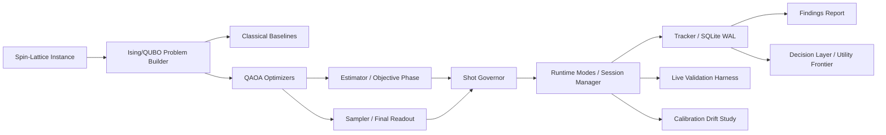

# System Overview

The repository is a **runtime-aware benchmarking engine for constrained frustrated-spin search**. It builds spin-lattice instances, evaluates classical and quantum solvers under matched accounting rules, and emits reproducible artifact bundles for study and review.
